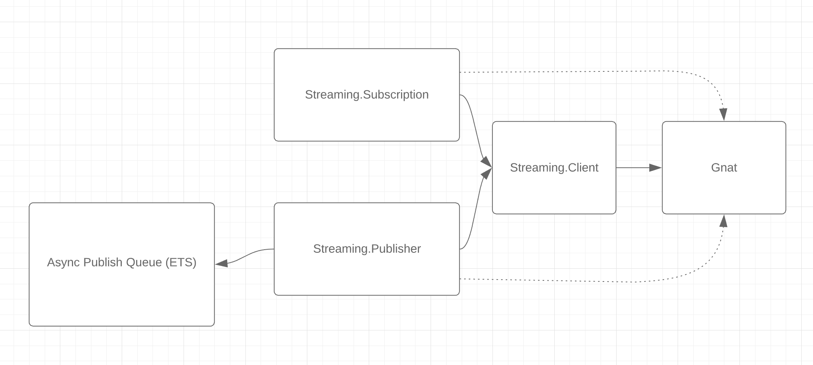
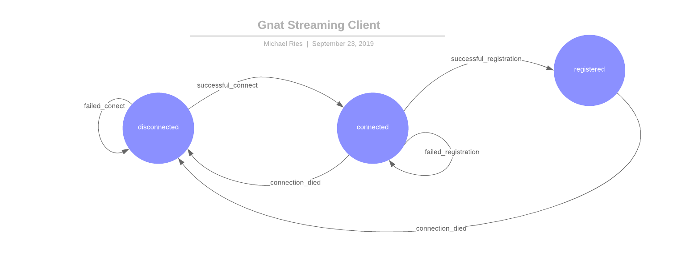

# Nats Streaming

A [NATS Streaming](https://nats.io/documentation/streaming/nats-streaming-intro/) client for Elixir.

## Installation

:warning: This is an alpha-stage piece of code.
I have tested it end-to-end, but not run it in production.
The API is liable to change as I experiment with better ways of managing the complexity of a streaming and acknowledging messages.

To use this, just add it to your mix deps.

```elixir
def deps do
  [
    {:nats_streaming, "~> 0.0.2"}
  ]
end
```

Then you'll need to supervise a connection, a client and as many subscriptions as you care to setup.
An example of all of this can be seen in https://github.com/mmmries/nats_streaming_example (you can see the specific diff [here](https://github.com/mmmries/nats_streaming_example/commit/765a6abf049985baf8710855dd1069edb0291ffb))

## Architecture

In the long run, I hope to encompass all the common use-cases of NATS streaming into a simple API in the `Nats.Streaming` module.
Since I don't yet know what the common use-cases are, and what will be required in terms of structure, I am mostly focused on the level of abstraction below that.
Currently, I'm thinking we will end up with a process architecture like:



We will leave the details of managing TCP/TLS connections and the low-level protocol to the [nats.ex library](https://github.com/nats-io/nats.ex).
In order to do any NATS streaming activities, we start up a `Streaming.Client` process which is given the name of a `Gnat` (provided by nats.ex).
The client process is a state machine that finds and monitors the `Gnat` process and registers itself as a nats streaming client.



We can also start `Streaming.Subscription` processes that find and monitor the `Streaming.Client` process (as well as monitoring the `Gnat` process).
These processes wait for the client to be registered and then use metadata about the client to open a subscription.
As messages start to come in for the given topic, they are decoded and we run the `consuming_function` specified when starting that subscription in a [Task](https://hexdocs.pm/elixir/1.9.1/Task.html).
Your `consuming_function` should accept a single argument (a `Streaming.Message` struct), and should call `Message.ack/1` once you have ensured that it has been handled.

> Since each message is handled in its own process, this can quickly saturate all cores on a machine.
> Please use the `max_in_flight` option when opening your subscription to limit how many message you want to run in parallel.

Subscriptions monitor the `Streaming.Client` and the `Gnat` connection to automatically re-subscribe if the connection goes down temporarily.


## Benchmarking

Most of the performance concerns I have for this library are around steady-state throughput.
So I've opted for a benchmarking strategy where data is collected into an external service.
In order to make this all work I start things up like this:

```
docker run -it --rm -p 3003:3003 -p 3004:8888 -p 8086:8086 -p 8125:8125/udp samuelebistoletti/docker-statsd-influxdb-grafana:latest
nats-streaming-server -m 8222 -mm 10000000
```

Once both of those are up and running you can run a benchmark like:

```
mix run bench/pulish.exs
```

Then go to `http://localhost:3003/`, login with credentials `root`/`root` and import a dashboard like this:

<details>
  <summary>Grafana Dashboard</summary>

```json
{
  "annotations": {
    "list": [
      {
        "builtIn": 1,
        "datasource": "-- Grafana --",
        "enable": true,
        "hide": true,
        "iconColor": "rgba(0, 211, 255, 1)",
        "name": "Annotations & Alerts",
        "type": "dashboard"
      }
    ]
  },
  "editable": true,
  "gnetId": null,
  "graphTooltip": 0,
  "id": 2,
  "links": [],
  "panels": [
    {
      "aliasColors": {},
      "bars": false,
      "dashLength": 10,
      "dashes": false,
      "datasource": "InfluxDB",
      "fill": 1,
      "gridPos": {
        "h": 8,
        "w": 24,
        "x": 0,
        "y": 0
      },
      "id": 4,
      "legend": {
        "avg": false,
        "current": false,
        "max": false,
        "min": false,
        "show": true,
        "total": false,
        "values": false
      },
      "lines": true,
      "linewidth": 1,
      "links": [],
      "nullPointMode": "null",
      "paceLength": 10,
      "percentage": false,
      "pointradius": 2,
      "points": false,
      "renderer": "flot",
      "seriesOverrides": [],
      "stack": false,
      "steppedLine": false,
      "targets": [
        {
          "alias": "Received/sec",
          "groupBy": [
            {
              "params": [
                "1s"
              ],
              "type": "time"
            },
            {
              "params": [
                "null"
              ],
              "type": "fill"
            }
          ],
          "measurement": "recvd",
          "orderByTime": "ASC",
          "policy": "default",
          "refId": "A",
          "resultFormat": "time_series",
          "select": [
            [
              {
                "params": [
                  "value"
                ],
                "type": "field"
              },
              {
                "params": [],
                "type": "sum"
              }
            ]
          ],
          "tags": []
        }
      ],
      "thresholds": [],
      "timeFrom": null,
      "timeRegions": [],
      "timeShift": null,
      "title": "Received per Sec",
      "tooltip": {
        "shared": true,
        "sort": 0,
        "value_type": "individual"
      },
      "type": "graph",
      "xaxis": {
        "buckets": null,
        "mode": "time",
        "name": null,
        "show": true,
        "values": []
      },
      "yaxes": [
        {
          "format": "short",
          "label": null,
          "logBase": 1,
          "max": null,
          "min": null,
          "show": true
        },
        {
          "format": "short",
          "label": null,
          "logBase": 1,
          "max": null,
          "min": null,
          "show": true
        }
      ],
      "yaxis": {
        "align": false,
        "alignLevel": null
      }
    },
    {
      "aliasColors": {},
      "bars": false,
      "dashLength": 10,
      "dashes": false,
      "datasource": "InfluxDB",
      "fill": 1,
      "gridPos": {
        "h": 8,
        "w": 24,
        "x": 0,
        "y": 8
      },
      "id": 6,
      "legend": {
        "avg": false,
        "current": false,
        "max": false,
        "min": false,
        "show": true,
        "total": false,
        "values": false
      },
      "lines": true,
      "linewidth": 1,
      "links": [],
      "nullPointMode": "null",
      "paceLength": 10,
      "percentage": false,
      "pointradius": 2,
      "points": false,
      "renderer": "flot",
      "seriesOverrides": [],
      "stack": false,
      "steppedLine": false,
      "targets": [
        {
          "alias": "Ack/sec",
          "groupBy": [
            {
              "params": [
                "1s"
              ],
              "type": "time"
            },
            {
              "params": [
                "null"
              ],
              "type": "fill"
            }
          ],
          "measurement": "ackd",
          "orderByTime": "ASC",
          "policy": "default",
          "refId": "A",
          "resultFormat": "time_series",
          "select": [
            [
              {
                "params": [
                  "value"
                ],
                "type": "field"
              },
              {
                "params": [],
                "type": "sum"
              }
            ]
          ],
          "tags": []
        }
      ],
      "thresholds": [],
      "timeFrom": null,
      "timeRegions": [],
      "timeShift": null,
      "title": "Acks per Second",
      "tooltip": {
        "shared": true,
        "sort": 0,
        "value_type": "individual"
      },
      "type": "graph",
      "xaxis": {
        "buckets": null,
        "mode": "time",
        "name": null,
        "show": true,
        "values": []
      },
      "yaxes": [
        {
          "format": "short",
          "label": null,
          "logBase": 1,
          "max": null,
          "min": null,
          "show": true
        },
        {
          "format": "short",
          "label": null,
          "logBase": 1,
          "max": null,
          "min": null,
          "show": true
        }
      ],
      "yaxis": {
        "align": false,
        "alignLevel": null
      }
    },
    {
      "aliasColors": {},
      "bars": false,
      "dashLength": 10,
      "dashes": false,
      "datasource": "InfluxDB",
      "fill": 1,
      "gridPos": {
        "h": 9,
        "w": 24,
        "x": 0,
        "y": 16
      },
      "id": 2,
      "legend": {
        "avg": false,
        "current": false,
        "max": false,
        "min": false,
        "show": true,
        "total": false,
        "values": false
      },
      "lines": true,
      "linewidth": 1,
      "links": [],
      "nullPointMode": "null",
      "paceLength": 10,
      "percentage": false,
      "pointradius": 2,
      "points": false,
      "renderer": "flot",
      "seriesOverrides": [],
      "stack": false,
      "steppedLine": false,
      "targets": [
        {
          "alias": "pub/sec",
          "groupBy": [
            {
              "params": [
                "1s"
              ],
              "type": "time"
            },
            {
              "params": [
                "null"
              ],
              "type": "fill"
            }
          ],
          "measurement": "pubd",
          "orderByTime": "ASC",
          "policy": "default",
          "refId": "A",
          "resultFormat": "time_series",
          "select": [
            [
              {
                "params": [
                  "value"
                ],
                "type": "field"
              },
              {
                "params": [],
                "type": "sum"
              }
            ]
          ],
          "tags": []
        }
      ],
      "thresholds": [],
      "timeFrom": null,
      "timeRegions": [],
      "timeShift": null,
      "title": "Pubs per Second",
      "tooltip": {
        "shared": true,
        "sort": 0,
        "value_type": "individual"
      },
      "type": "graph",
      "xaxis": {
        "buckets": null,
        "mode": "time",
        "name": null,
        "show": true,
        "values": []
      },
      "yaxes": [
        {
          "format": "short",
          "label": null,
          "logBase": 1,
          "max": null,
          "min": null,
          "show": true
        },
        {
          "format": "short",
          "label": null,
          "logBase": 1,
          "max": null,
          "min": null,
          "show": true
        }
      ],
      "yaxis": {
        "align": false,
        "alignLevel": null
      }
    }
  ],
  "schemaVersion": 18,
  "style": "dark",
  "tags": [],
  "templating": {
    "list": []
  },
  "time": {
    "from": "now-15m",
    "to": "now"
  },
  "timepicker": {
    "refresh_intervals": [
      "5s",
      "10s",
      "30s",
      "1m",
      "5m",
      "15m",
      "30m",
      "1h",
      "2h",
      "1d"
    ],
    "time_options": [
      "5m",
      "15m",
      "1h",
      "6h",
      "12h",
      "24h",
      "2d",
      "7d",
      "30d"
    ]
  },
  "timezone": "",
  "title": "Gnat Streaming",
  "uid": "D-RMocGWz",
  "version": 4
}
```
</details>
